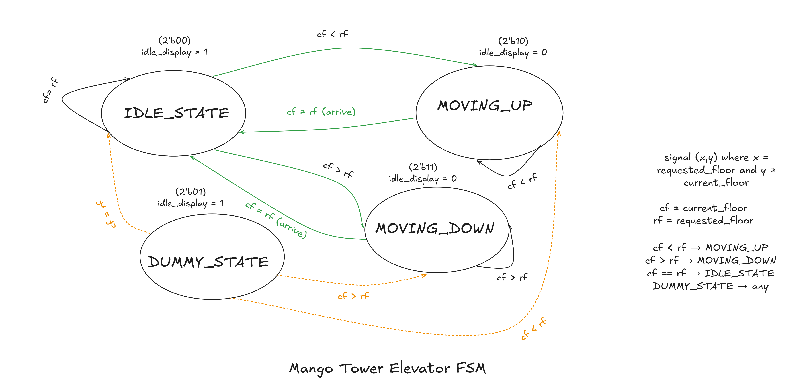

# Solution

### Part A - Reference Finite state diagram

---

### Part B - Completed Transition Table

| `current_state` | Condition                          | `next_state`  | `idle_display` |
| --------------- | ---------------------------------- | ------------- | -------------- |
| `IDLE_STATE`    | `current_floor < requested_floor`  | `MOVING_UP`   | `1`            |
| `IDLE_STATE`    | `current_floor > requested_floor`  | `MOVING_DOWN` | `1`            |
| `IDLE_STATE`    | `current_floor == requested_floor` | `IDLE_STATE`  | `1`            |
| `MOVING_UP`     | `current_floor < requested_floor`  | `MOVING_UP`   | `0`            |
| `MOVING_UP`     | `current_floor >= requested_floor` | `IDLE_STATE`  | `0`            |
| `MOVING_DOWN`   | `current_floor > requested_floor`  | `MOVING_DOWN` | `0`            |
| `MOVING_DOWN`   | `current_floor <= requested_floor` | `IDLE_STATE`  | `0`            |
| `DUMMY_STATE`   | any                                | `IDLE_STATE`  | `1`            |

---

### Part C - Model Short Answers

1. **Why is `DUMMY_STATE` grouped with `IDLE_STATE` in the case statement rather than with `MOVING_UP` or `MOVING_DOWN?`**
   `DUMMY_STATE` is not a real state that an elevator transitions to normally, but rather it is a placeholder state. This state exists only because in a 2-bit signal register, all four values must have defined behaviour. Therefore, since the safest state in an elevator is to be idle or do nothing that affects the system, with `idle_display = 1` then it is paired together with `IDLE_STATE` such that if by an error the bits switch lands on `2'b01`, it quickly recovers by going to idle_state before normal move behaviour. The reverse of this case would not be ideal as it could lead a corrupted bit to function normal as without error.

2. **What would happen if the sequential block missed the `default` clause in the always block?**
   Since in this case all four values of the 2-bit register are defined, the elevator FSM would still function normally, if the `default` clause were not set. **But** dropping it is still bad practice: in a combinational `always @(*)` `case`, any uncovered
   input value with no `default` leaves `next_state` unassigned on that path, which infers a **latch** and could lead to a bug during synthesis if missing.

3. **If `requested_floor` is `4'b1111` (floor 15), where does the FSM end up? Is that safe?\***
   The FSM follows the path to fulfill the request: from idle, it enters `MOVING_UP` and the floor counter
   increments one floor per delay cycle until `current_floor == 15`, then returns back to `IDLE STATE`. The 4-bit
   counter can represent 0–15, so floor 15 exists and elevator simply "arrives" at floor 15. **This is not
   safe:** floor 15 does not physically exist (the Mango Tower tops out at floor 8 if starting at floor 0) and there is **no clamp
   or bound check** anywhere in the FSM. The stop condition is purely "keep moving until
   `current_floor == requested_floor`. Therefore, there should have been a check to stop the elevation from occurring past the last existing floor or should signal an error upon request.
